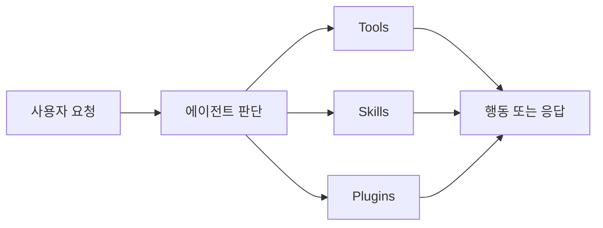

# 에이전트 AI와 OpenClaw
## “대답하는 AI”에서 “행동하는 AI”로

소프트웨어학부 22학번 강지웅

이제 AI는 설명만 하는 걸 넘어서, 실제 작업을 수행하는 방향으로 가고 있습니다.

<!--
안녕하세요, 소프트웨어학부 22학번 강지웅입니다.
오늘은 에이전트 AI와 OpenClaw에 대해 발표하겠습니다.
요즘 AI라고 하면 단순히 답만 해주는 챗봇보다,
코딩 에이전트처럼 실제 작업을 수행하는 AI를 먼저 떠올리는 경우가 많습니다.
오늘 발표에서는 그 흐름을 조금 더 넓게 설명하는 개념인 에이전트 AI와,
그 사례로 볼 수 있는 OpenClaw를 간단히 소개해보겠습니다.
-->

---
layout: default
---

# 에이전트 AI란?

- **목표를 받아서 일을 처리하는 AI**
- 단순 답변형 챗봇(Chatbot)과 다름
- 핵심: **계획 · 도구 사용 · 실행**

| 일반 챗봇 | 에이전트 AI |
|---|---|
| 질문 → 답변 | 목표 → 작업 수행 |
| 한 번의 응답 중심 | 여러 단계 연결 |
| 설명에 강함 | 행동에 강함 |

<!--
에이전트 AI는 쉽게 말해서 질문에 답만 하는 AI가 아니라,
목표를 주면 그 목표를 해결하기 위해 여러 단계를 이어가는 AI입니다.
예를 들어 일반 챗봇은 개념 설명을 잘해주지만,
에이전트 AI는 자료 찾기, 정리하기, 초안 만들기 같은 작업 흐름까지 연결할 수 있습니다.
그래서 핵심은 planning, tool use, execution,
즉 계획하고, 필요한 도구를 쓰고, 실제로 실행하는 구조라고 볼 수 있습니다.
-->

---
layout: default
---

# 왜 지금 중요할까?

- 웹 검색과 정보 수집
- 문서 정리와 요약
- 코드 작성과 수정
- 이메일 · 일정 · 반복 업무 보조

### 핵심
**답변 품질 경쟁**에서 **작업 수행 능력** 경쟁으로 넘어가는 중

<!--
에이전트 AI가 중요한 이유는,
이제 AI가 답변을 잘하는 수준을 넘어서 실제 작업을 연결해서 처리하는 방향으로 발전하고 있기 때문입니다.
예전에는 검색 따로, 정리 따로, 작성 따로였다면,
지금은 이런 단계를 하나의 흐름처럼 묶어서 처리하는 방식이 점점 중요해지고 있습니다.
그래서 에이전트 AI는 단순한 챗봇의 업그레이드라기보다,
업무 자동화 쪽으로 확장되는 흐름이라고 이해하는 게 더 맞다고 생각합니다.
-->

---
layout: default
---

# OpenClaw는 어떤 사례일까?

- **오픈소스(Open-source) 기반**의 개인형 에이전트 AI 플랫폼
- 사용자가 직접 운영하고 실험해볼 수 있음
- 채팅 기반 인터페이스로 요청을 받고 행동으로 연결

### 왜 좋은 예시인가?
**“AI가 뭘 아는가”보다 “AI가 뭘 하게 되는가”를 보여줌**

<!--
OpenClaw를 가져온 이유는,
에이전트 AI가 실제로 어떤 모습으로 구현될 수 있는지 보여주기 좋기 때문입니다.
OpenClaw는 오픈소스 기반이라 구조를 직접 보고 이해할 수 있고,
개인이 실험해보기도 비교적 좋습니다.
중요한 건 AI가 단순히 답을 아는 데서 끝나는 게 아니라,
요청을 받고 필요한 기능을 사용해서 실제 행동으로 이어진다는 점입니다.
그래서 에이전트 AI의 사례로 설명하기에 적절합니다.
-->

---
layout: default
---

# OpenClaw의 구조

- **Tools**: 실제 기능 호출
- **Skills**: 언제, 어떻게 행동할지에 대한 가이드
- **Plugins**: 외부 서비스와의 연결과 확장

<!--
OpenClaw의 구조를 보면 에이전트 AI가 왜 단순 모델과 다른지 더 잘 보입니다.
Tools는 검색이나 실행 같은 실제 기능이고,
Skills는 어떤 상황에서 어떤 기능을 써야 하는지에 대한 행동 가이드입니다.
Plugins는 외부 서비스나 환경과 연결해주는 확장 요소입니다.
결국 에이전트 AI는 모델 하나가 똑똑한 것으로 끝나는 게 아니라,
생각하는 부분, 행동하는 도구, 연결 구조가 함께 있어야 제대로 작동한다는 걸 보여줍니다.
-->

---
layout: center
---

# 한계와 결론

- **Prompt Injection** 같은 보안 위험
- AI에 너무 큰 권한을 줄 때의 문제
- 로그 · 메모리 · 개인정보 노출 가능성

## takeaway
1. 에이전트 AI는 **행동하는 AI**다
2. OpenClaw는 그 구조를 보여주는 사례다
3. 앞으로의 핵심은 **성능 + 안전한 통제**다

<!--
물론 이런 시스템은 강력한 만큼 위험도 큽니다.
대표적으로 프롬프트 인젝션, 과도한 권한 부여,
그리고 로그나 메모리, 개인정보 노출 같은 문제가 있습니다.
일반 챗봇은 틀린 답을 하는 데서 끝날 수 있지만,
에이전트 AI는 경우에 따라 실제 행동까지 할 수 있기 때문입니다.
정리하자면 에이전트 AI는 대답하는 AI에서 행동하는 AI로 넘어가는 흐름이고,
OpenClaw는 그 흐름을 잘 보여주는 사례입니다.
앞으로 중요한 것은 AI가 무엇을 아느냐뿐 아니라,
무엇을 얼마나 안전하게 하게 둘 것인가라고 생각합니다.
감사합니다.
-->
